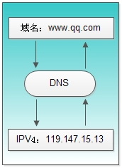
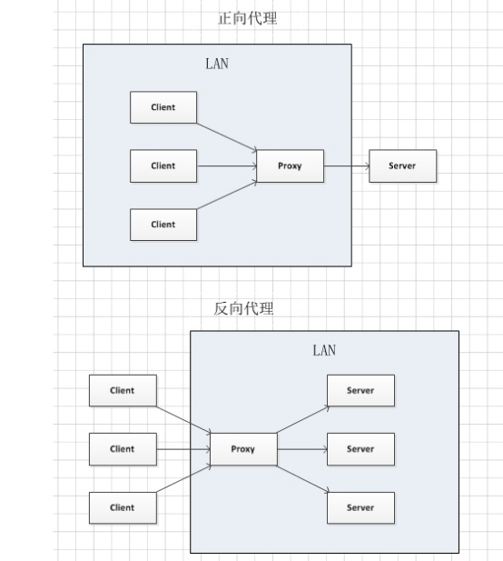

## 网络知识科普

#### IP

又名网路之间的互联协议，我们需要记住它是由4个字节组成的，如我们的本机ip地址127.0.0.1。我们访问服务器是通过ip地址来访问的，即使输入的是域名，最终都会通过DNS域名解析转换成对应的ip地址或者hosts中映射的ip地址。

### 域名

ip地址的标识，便于用户记忆和使用，在正常情况下访问ip和域名效果是一样的

域名的组成分为两部分，比如baidu.com这个域名，左侧部分是域名的主体，可以随意定义，在没被注册过的情况下可以随意定义，右侧部分是顶级域名，必须从已有选项中选择，顶级域名可分为三种：类别顶级域名(也通常称为国际顶级域名)、地理顶级域名、新顶级域名

##### 类别顶级域名：

.com--用于商业机构

.top--用于所有公司、组织和个人

.net--最初是用于网络组织，如因特网服务商和维修商

.int--国际组织

.int--国际组织

.mil--军事领域

.gov--政府部门

##### 地理顶级域名：

.cn--中国

.hk--香港

地理顶级域名还可以设置二级域，如：.com.cn、.net.cn

##### 新顶级域名：

.aero--航空运输业专用，由比利时国际航空通信技术协会（SITA）负责

.biz--可以替代.com的通用域名，监督机构是JVTeam

.coop--商业合作社专用，由位于华盛顿的美国全国合作商业协会（NCBA）负责管理

.info--可以替代.net的通用域名，由19个因特网域名注册公司联合成立的Afilias负责

.museum--博物馆专用，由博物馆域名管理协会（MDMA）监督

.name--是个人网站的专用域名，由英国的“环球姓名注册”（GlobeNameRegistry）负责； 
.pro--医生和律师等职业专用，监督机构是爱尔兰都柏林的一家网络域名公司“职业注册”（RegistryPro）

#### DNS

又叫域名系统，作为ip和域名互相映射的一个分布式系统。简单的说，DNS的作用就是把域名解析成对应的ip。当我们通过域名访问时，如果没有在hosts中做映射处理，那么我们所输入的域名就会通过DNS来查找出对应的ip地址，然后在通过ip地址进行访问。所以在DNS解析这一环节就显得很重要，如果解析出错的话就会导致访问失败，有一种防火墙封锁访问的方法就是利用了这一点，在DNS对某些域名解析时进行干扰，然后返回了一个错误的ip地址，这样就没办法访问了，这就是所谓的DNS污染。我们无法访问谷歌等一些网站其实就是大陆的防火墙进行了DNS污染，让你访问的某些域名无法得到正确的ip地址。

#### HOSTS

是不是只要防火墙进行了DNS污染就不能访问谷歌等某些网站呢?答案当然是否定的。我们还可以在hosts中保存域名和ip地址的映射关系来达到可以正常访问的目的。为什么保存了域名和ip地址的映射关系就能正常访问呢？这就是hosts的作用了，hosts文件本身的作用就是用来提高解析效率的，它的优先级比DNS要高，如果在hosts文件中保存了某个域名的映射，就能直接通过这个域名映射的ip地址来访问而不需要不通过DNS解析，这样就能绕过防火墙的DNS污染了。

#### 代理服务器

除了改hosts以外，还可以通过代理服务器的方式来访问到被墙的网站。代理就是通过一个中间代理服务器来代替客户端访问目标服务器。代理服务器又分为正向代理和反向代理，正向代理和反向的代理的区别就是取决于隐藏真正客户端还是真正服务端，如果隐藏真正客户端的话就是正向代理，隐藏真正服务端是反向代理。vpn代理就是一种正向代理。反向代理可以通过nginx来进行反向代理

